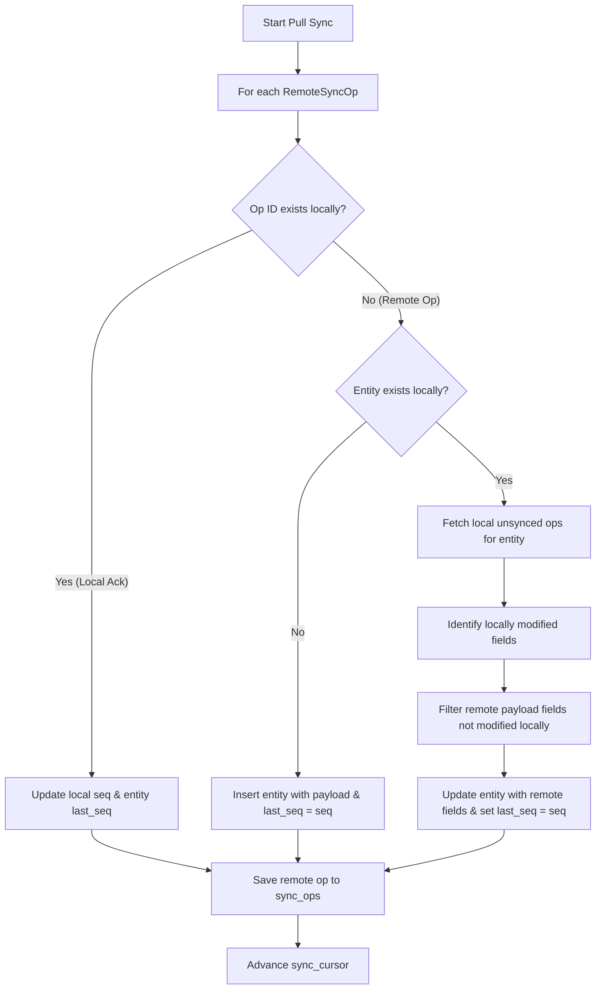

# Conflict Resolution

This document outlines the client-side conflict resolution path for `docsgraph`'s local-first sync protocol.

## Core Principles

1. **Local-first Write Path**: All local modifications (offline or online) are committed to the local database immediately and logged as a `SyncOp` with `seq = NULL` in `sync_ops`.
2. **Field-level Last-Write-Wins (LWW)**: Updates from the server are applied to local records by comparing server-assigned sequence numbers (`sequence`). The server sequence number acts as the global tie-breaker.
3. **Offline Edit Preservation**: When a remote operation is pulled from the server, any fields modified locally offline (and not yet pushed/acked) take precedence over the incoming remote operation fields. This ensures that the user's offline work is never silently discarded.

## How Conflict Resolution Works

When the client pulls `RemoteSyncOp` records via the sync client, it processes them sequentially within a database transaction:

### Detailed Cases

#### 1. Local Ack (Own Operation)
If the pulled operation's `id` already exists in the client's `sync_ops` table, it is a local mutation that has been successfully pushed and sequenced by the server. 
- The client updates the local op's `seq` to match the server's sequence number.
- The client updates the corresponding entity's `last_seq` column to this sequence number.

#### 2. Remote Create / Update
If the operation's `id` does not exist in `sync_ops`:
- **If the entity does not exist locally**: The client inserts the entity using the operation's payload, setting its `last_seq` to the server's sequence number.
- **If the entity does exist locally**:
  - The client queries `sync_ops` for any local unsynced ops (`seq IS NULL`) affecting this entity.
  - The client parses the payloads of those unsynced ops to compile a list of fields modified locally offline.
  - The client updates the entity's columns using the remote operation's payload, **excluding** any fields that are in the locally modified list.
  - The entity's `last_seq` is advanced to the remote sequence number.
  - The remote operation is inserted into `sync_ops` with its sequence number to prevent redundant processing.

#### 3. Remote Delete
- If the remote operation is a `delete`:
  - The client checks if there are any local unsynced ops (`seq IS NULL`) for this entity.
  - If there are **no unsynced ops**, the entity is deleted from the local database table.
  - If there **are unsynced ops**, the deletion is deferred/ignored because the user's offline modifications are newer and take precedence.
  - The remote operation is saved to the local `sync_ops` table.
